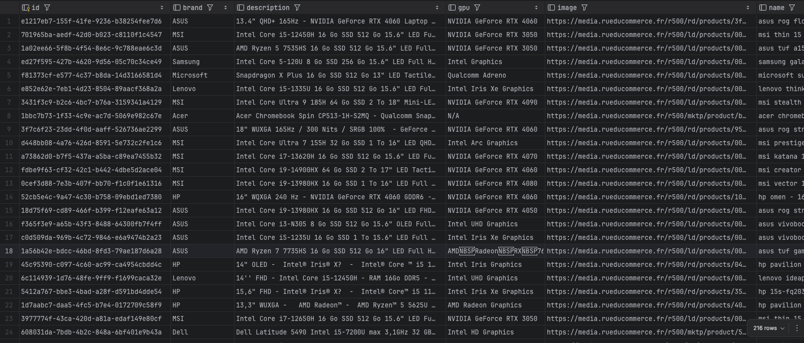
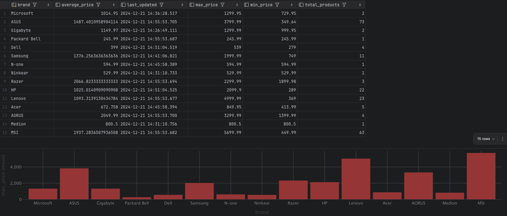

# Projet final - ETL E-commerce

## Groupe 
Audran MASSACRY  
Rodrigo Oliveira Reis  
Eliott Fertille  

## Description
Ce projet est un pipeline ETL qui permet de récupérer des données du site rueducommerce, de les transformer et de les charger dans une base de données.

## Prérequis
- Node.js
- Python 3
- Cassandra
- npm

## Installation
1. Cloner le projet
    ```
    git clone <URL_DU DEPOT>
    cd <NOM_DU_DEPOT>
    ```
   
2. Installer les dépendances Node.js
    ```sh
    npm install
    ```
   
3. Initialiser la base de données Cassandra sur docker
    ```sh
    docker pull cassandra:latest
    docker run --name cassandra -d -p 9042:9042 cassandra:latest
    docker exec -it cassandra cqlsh <DOCKER_IP> <PORT>
    CREATE KEYSPACE IF NOT EXISTS your_keyspace WITH replication = {'class': 'SimpleStrategy', 'replication_factor': 1};
    ```

    Puis renseigner les informations de connexion à la base de données dans le fichier `.env`.

    ```env
    CASSANDRA_CONTACT_POINTS=127.0.0.1
    CASSANDRA_LOCAL_DATA_CENTER=datacenter1
    CASSANDRA_KEYSPACE=big_data
    ```

4. Lancer le pipeline ETL
    ```sh
    npm start
    ```
   
Le scraping des données se fait automatiquement toutes les 10 minutes grâce à une tâche cron. Les données sont ensuite transformées et chargées dans la base de données Cassandra.

## Endpoints
- `GET /products`: Récupère tous les produits'
- `GET /brands/statistics`: Récupère les statistiques sur les marques'

Les endpoints renvoies des données au format JSON afin d'avoir une meilleure manipulation des données dans une application par exemple.

## Structure du projet
- `src/`: Contient le code source du projet
    - `process/extract.js`: Contient le code pour scrap l'ensemble des données
    - `process/load.js`: Contient le code pour initialiser et insérer les données dans la base de données
    - `process/transform.py`: Contient les fonctions pour manipuler et transformer les données
- `server.js`: Contient le code source du serveur Express

## Choix techniques

### Playwright (Extract)
Nous avons choisi Playwright pour l'extraction des données en raison de sa capacité à interagir avec des pages web dynamiques, notamment celles générées par JavaScript. Playwright permet de gérer des scénarios complexes comme le défilement infini ou l'extraction de données à partir de contenu chargé dynamiquement. Il est également multi-navigateurs, ce qui permet une plus grande flexibilité.

### Python (Transform)
Pour la transformation des données, nous avons décidé de ne pas utiliser Pandas. Bien que Pandas soit un excellent outil pour le traitement de données complexes, nous avons estimé que dans notre cas, nous pouvions gérer la transformation sans. Nous effectuons un scraping de 50 produits maximum à la fois, ce qui nous permet de traiter efficacement les données à l'aide de simples boucles et opérations de base en Python. L'absence de Pandas simplifie également notre code et réduit la consommation mémoire, étant donné la taille limitée des données traitées à chaque itération.

### Cassandra (Load)
Cassandra a été sélectionné comme base de données NoSQL en raison de sa capacité à gérer des volumes massifs de données tout en garantissant une haute disponibilité. Cassandra est particulièrement adaptée à un modèle de données clé-valeur, ce qui facilite la gestion de données non structurées, comme celles collectées via le scraping. En utilisant des clés primaires composites, nous avons optimisé l'accès aux données tout en garantissant des performances élevées.


## Fonctionnement

### Extraction

Les données sont extraites via le scraper `PlayWright`. Toutes les 10 minutes le scraper va se rendre sur la catégorie `pc protable` du site `rueducommerce` et récupérer les informations suivantes pour chaque pc:
- Nom
- Description
- Prix
- Marque
- Image
- Type de processeur
- Type de GPU
- RAM
- Taille de l'écran
- stock (En stock / Rupture)

### Transformation
Les données sont ensuite envoyées à un fichier python qui effectuent plusieurs actions :
- Nettoyage des prix en enlevant tous les caractères spéciaux et tranformation en `float`
- Uniformisation des noms des produits en lowercase
- Transformation du stock en `boolean`
- Suppression des doublons en fonction du nom et du prix du produit
- Calcul des statistiques pour les marques
  - Calcul du nombre de produits par marque
  - Calcul du prix moyen par marque
  - Calcul du prix minimum par marque
  - Calcul du prix maximum par marque

### Load
Les données sont ensuite chargées dans une base de données Cassandra. Les produits sont stockées dans une table `products` et les statistiques sur les marques sont stockées dans une table `brands_stats`.
Voici une capture d'écran et un format json des données à retrouver dans la base de données:

`products`:  



    ```json
    {
      "id": "1543f7d9-b4d3-46e7-9560-407f401cba8a",
      "brand": "AORUS",
      "description": "AORUS 16\" QHD - NVIDIA GeForce RTX 4060- Intel Core i7-13650HX - RAM 16 Go DDR5 - SSD 1 To - AZERTY - Windows 11",
      "gpu": "NVIDIA GeForce RTX 4060",
      "image": "https://media.rueducommerce.fr/r500/rd/products/1fd/1fd34c4e260031b16092ee6cef00f27be7612b7c.png",
      "name": "aorus 16x 9kg - 9kg-43frc54sh - midnight gray",
      "price": "1399.99",
      "processor": "Intel Core i7",
      "ram": "DDR5 4800 MHz",
      "scraped_at": "2024-12-21T12:21:48.106Z",
      "screen_size": "16 pouces",
      "stock": "En stock"
    }
    ```

`brands_stats`:  



    ```json
    {
      "brand": "ASUS",
      "average_price": "1145.7848",
      "last_updated": "2024-12-21T12:31:10.845Z",
      "max_price": "3799.99",
      "min_price": "349.64",
      "total_products": 25
    }
    ```

## Difficultés rencontrées

La difficulté principale rencontré est le bannissement temporaire effectué par les sites e-commerce quand un trop grand nombre de requêtes sont effectuées en peu de temps.  
Cette difficulté est surtout apparue pendant les cours où un grand nombre de personnes effectuaient des requêtes en même temps.
Sur un réseau personnel, le bannissement est moins fréquent. Un ajout de timeout de 2s entre chaque changement de page a aussi été ajouté pour éviter le bannissement. 
Nous avons aussi changé la fonction de scrap pour qu'elle effectue seulement le scrap des produits d'une seule page (incrémentée à chaque itération) toutes les 10 minutes.

Une autre difficulté rencontré peut aussi être le changement de structure du site web qui peut casser le scraper. 
